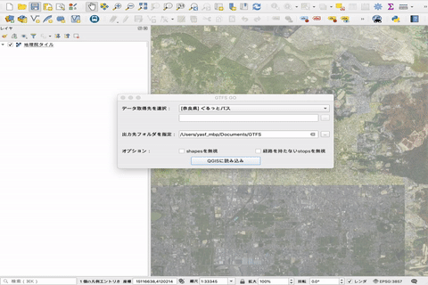

# GTFS-GO

QGIS Plugin to extract GTFS-data as GeoJSON and render routes and stops on the Map.

## Usage

## Custom Datalist

## Want to add new data sources?

- Some data sources can be added from [here](https://transitfeeds.com/search?q=gtfs) however you need to check they have all the [required](https://github.com/MIERUNE/GTFS-GO/blob/master/gtfs_parser/constants.py) .txt files

### Datalist-Json Spec
