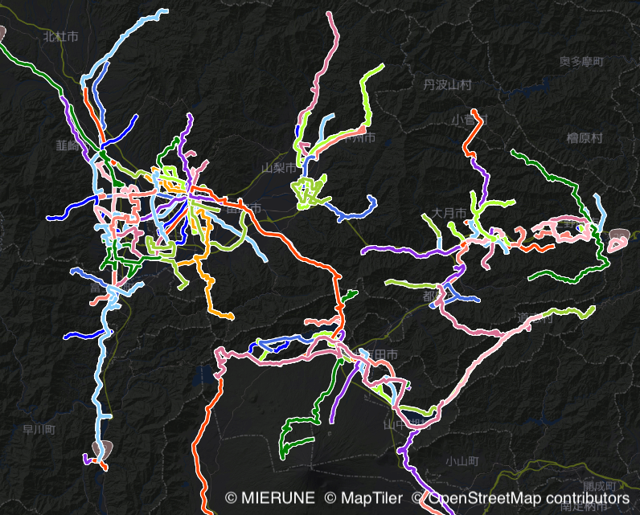
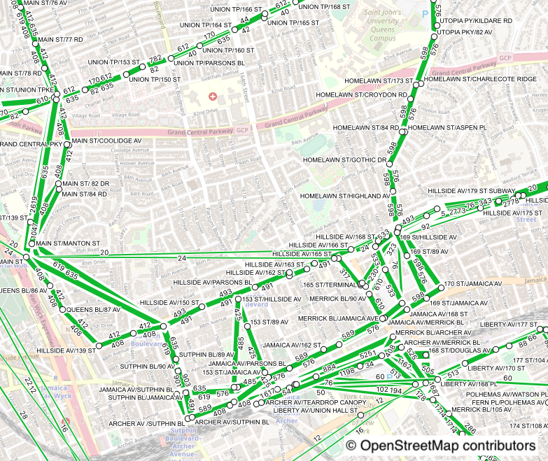
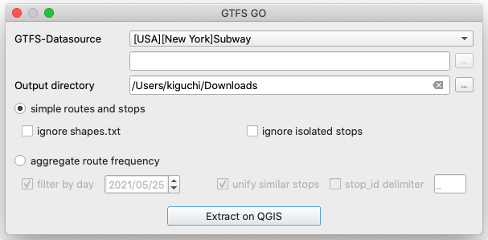
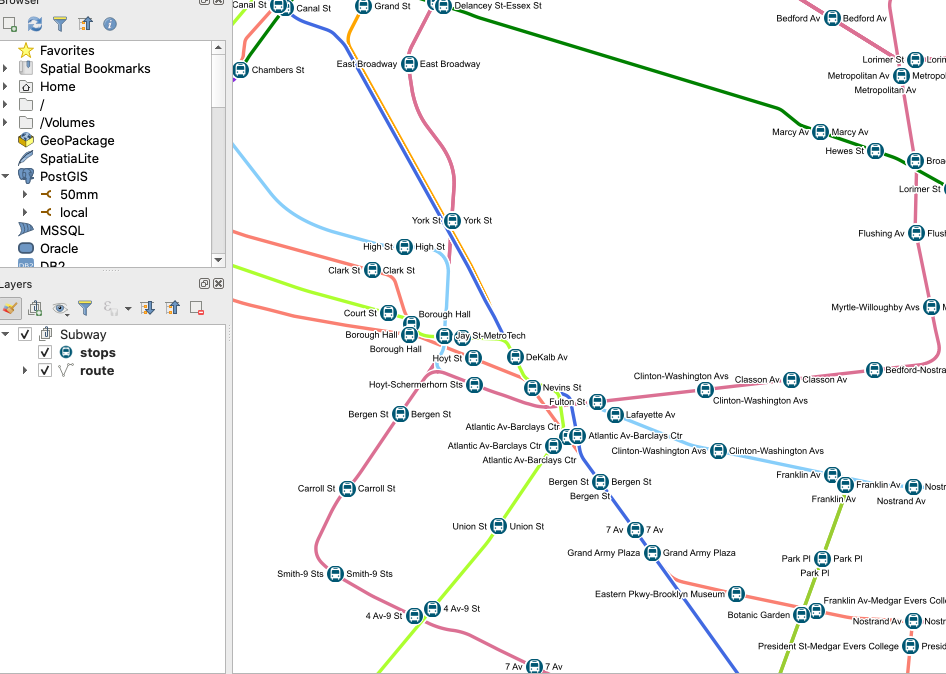
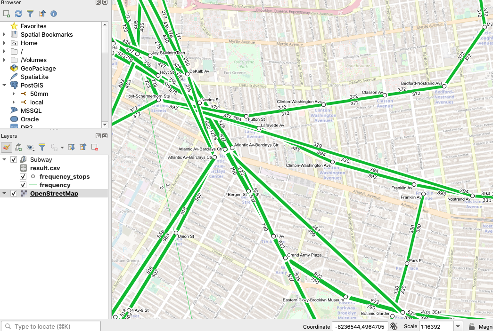
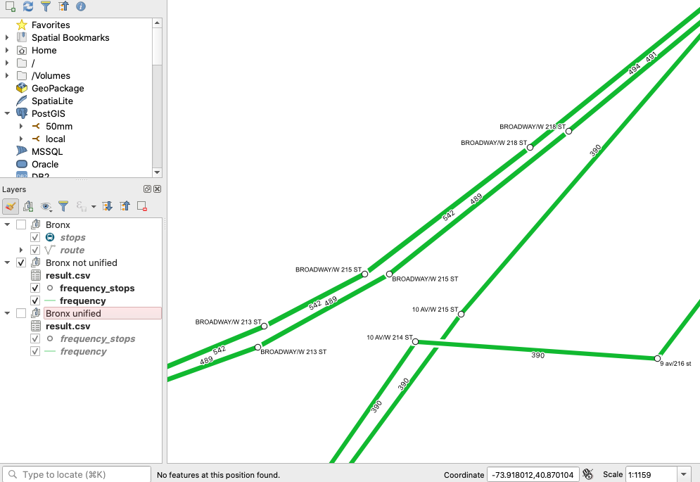
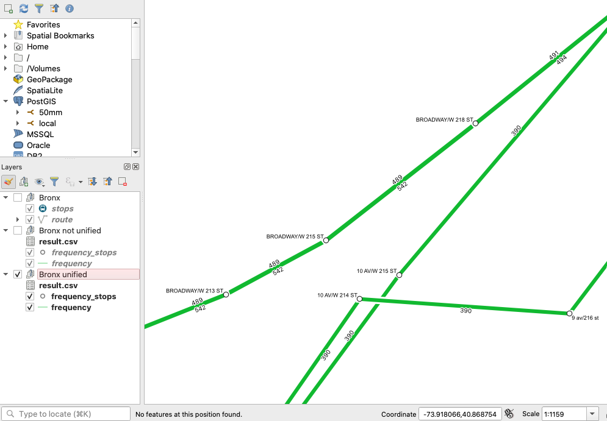
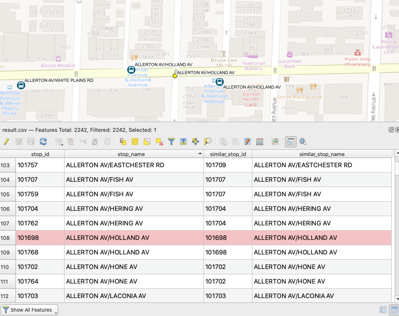

# GTFS-GO


QGIS Plugin to extract GTFS-data as GeoJSON and render routes and stops on the Map.

  


## Usage



### General

#### Select datasource

- local zipfile
- download preset datasource

### Processing

#### Simple parsing - routes and stops



GTFS tables has routes-data and stops-data but tables-structure is somewhat complicated.  
This plugin can parse them into simple routes and stops GeoJSON files, also set a beautiful style on layers.

#### Traffic frequency aggregation



GTFS also has service time-table information. This plugin can aggregate traffic frequency, how many times do each PATH used. PATH means lines between two stops.  
In addition, it is possible to unify SIMILAR stops - having same parent_stop or same prefix or same stop_name and near to each.

- numbers along with lines indicate a frequency of each lines, set on left side towards direction of path (UK traffic style)
- larger number of frequency, lines become bolder
- result.csv is a table comparing before and after unified stops.

### unifying algorithm

You can see similar stops unified into one stop.

- before

    

- after

    

#### stops unifying rules

Smaller number of rules is prefered.

1. parent_stops

    - if stops have parent_stops value, unifying them into parent station
    - new stop_id is parent's one

2. stop_id prefix

    - by defining delimiter, split stop_name into prefix and suffix, group same prefix stops
    - new stop_id is the first stop's one in grouped stops ordered by stop_id ascending.

3. stop_name and distance

    - unifying stops having same stop_name and near to each in certain extent - 0.003 degree in terms of lonlat-plane
    - new stop_id is the first stop's one in grouped stops ordered by stop_id ascending.

#### unifying result

In result.csv, you can see stops unifying result.



### Processing Toolbox

The conversions and the repository search are also available as Processing algorithms under the `GTFS-GO` provider, so they can be used in the Processing Toolbox, Graphical Modeler, batch processing and `processing.run()`. Input of the conversions is a local GTFS zip file.

| Algorithm | ID | Outputs |
| --- | --- | --- |
| Extract routes and stops | `gtfsgo:extractroutesandstops` | routes, stops |
| Aggregate traffic frequency | `gtfsgo:aggregatefrequency` | aggregated routes, aggregated stops, stop relations (table) |
| Search [Japan]GTFS data repository | `gtfsgo:searchjapandpf` | GTFS feeds (table, `file_url` is the URL of the GTFS zip) |

```python
processing.run(
    "gtfsgo:aggregatefrequency",
    {
        "INPUT": "/path/to/gtfs.zip",
        "UNIFY_STOPS": True,
        "DELIMITER": "",
        "DATE": QDate(2024, 4, 1),  # optional
        "BEGIN_TIME": "07:00:00",  # optional, requires END_TIME
        "END_TIME": "09:00:00",
        "OUTPUT_ROUTES": "TEMPORARY_OUTPUT",
        "OUTPUT_STOPS": "TEMPORARY_OUTPUT",
        "OUTPUT_STOP_RELATIONS": "TEMPORARY_OUTPUT",
    },
)
```

```python
processing.run(
    "gtfsgo:searchjapandpf",
    {
        "TARGET_DATE": QDate(2024, 4, 1),
        "EXTENT": "141.0,144.0,42.0,44.0 [EPSG:4326]",  # optional
        "PREF": 1,  # optional, prefecture code (1: 北海道 ... 47: 沖縄県), 0: any
        "OUTPUT": "TEMPORARY_OUTPUT",
    },
)
```

## Acknowledgements

Version2.0.0, in which the frequency aggregating function is added, got technically and financially supported by [Toyota Mobility Foundation](https://toyotamobilityfoundation.jp/) and [Traffic Brain](https://t-brain.jp/). Thank you for great contributions!

## Contribution

### Translation

Translations are JSON dictionaries keyed by the English source text (`i18n/<locale>.json`), not Qt .ts/.qm files. See [i18n/README.md](i18n/README.md).

1. wrap a new string with `i18n.tr("...")` in Python (strings in `.ui` files are picked up automatically, except `notr="true"`)
2. run `python3 i18n/extract.py --locale ja` (and `--locale fr`) to add the new keys with empty translations
3. fill the translations in `i18n/ja.json` / `i18n/fr.json` (no compilation needed)

### new data sources

- Some data sources can be added from [here](https://transitfeeds.com/search?q=gtfs) however you need to check they have all the [required](https://github.com/MIERUNE/GTFS-GO/blob/master/gtfs_parser/constants.py) .txt files

### Tests

- needs pandas

```
pip install pandas
```

```
cd GTFS-GO
python -m unittest discover gtfs_parser/tests
```
