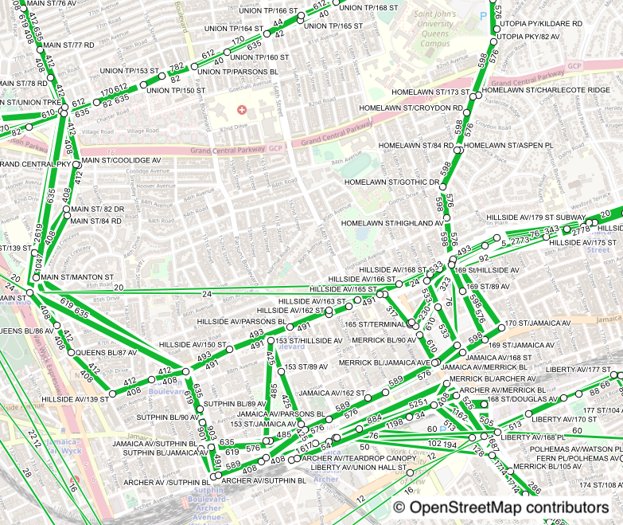
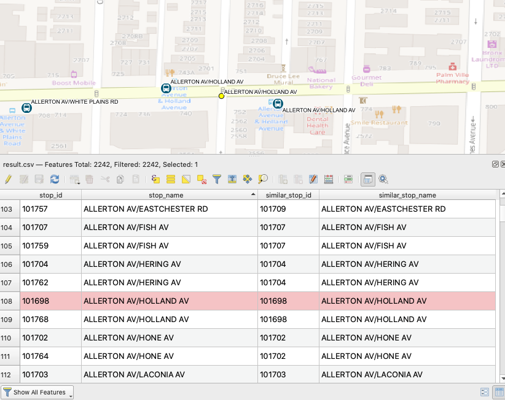

# GTFS-GO

QGIS Plugin to extract GTFS-data as GeoJSON and render routes and stops on the Map.

  

## Usage

### General

#### Select datasource

-   local zipfile
-   download preset datasource

### Processing

#### Simple parsing - routes and stops

GTFS tables has routes-data and stops-data but tables-structure is somewhat complicated.  
This plugin can parse them into simple routes and stops GeoJSON files, also set a beautiful style on layers.

#### Traffic frequency aggregation

GTFS also has service time-table information. This plugin can aggregate traffic frequency, how many times do each PATH used. PATH means lines between two stops.  
In addition, it is possible to unify SIMILAR stops - having same parent_stop or same prefix or same stop_name and near to each.

-   numbers along with lines indicate a frequency of each lines, set on left side towards direction of path (UK traffic style)
-   larger number of frequency, lines become bolder
-   result.csv is a table comparing before and after unified stops.

### unifying algorithm

You can see similar stops unified into one stop.

-   before

      

-   after

      

#### stops unifying rules

Smaller number of rules is prefered.

1.  parent_stops

    -   if stops have parent_stops value, unifying them into parent station
    -   new stop_id is parent's one

2.  stop_id prefix

    -   by defining delimiter, split stop_name into prefix and suffix, group same prefix stops
    -   new stop_id is the first stop's one in grouped stops ordered by stop_id ascending.

3.  stop_name and distance

    -   unifying stops having same stop_name and near to each in certain extent - 0.01 degree in terms of lonlat-plane
    -   new stop_id is the first stop's one in grouped stops ordered by stop_id ascending.

#### unifying result

In result.csv, you can see stops unifying result.

## Want to add new data sources?

-   Some data sources can be added from [here](https://transitfeeds.com/search?q=gtfs) however you need to check they have all the [required](https://github.com/MIERUNE/GTFS-GO/blob/master/gtfs_parser/constants.py) .txt files

## Contribution

### Translation

1. edit to `gtfs_go.pro` and add `GTFSGO_lang_encoding.ts` inside the `TRANSLATION` variable
2. cd i18n
3. generate the translation files with `pylupdate5 ../gtfs_go.pro` on debian you have to install pylupdate with `apt install pyqt5-dev-tools`
4. edit the newly generated file GTFSGO_lang.ts to contain the new translations
5. generate qm file with `lrelease GTFSGO_lang_encoding.ts`
